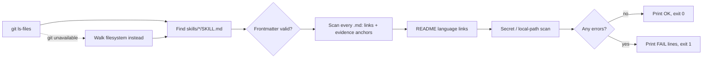

# Real walkthrough: this repo's own validator

This is a **real** run of the skill against [`scripts/validate.py`](../scripts/validate.py) in this repository — not a synthetic example. Every plain-text evidence anchor below (for example [confirmed scripts/validate.py:32]) is checked by CI: if the file changes and a line reference no longer exists, the build fails.

> Request: *"Use karpathy-explain to explain scripts/validate.py to a contributor who wants to add a new check. Give a 30-second summary, the success and failure paths, three places to read, and unverified assumptions."*

---

## 30 seconds

`validate.py` is the repository's gatekeeper: before a change is accepted, it checks that the skill is well-formed, links work, line references are real, and no secrets slipped in.

Analogy: an airport security check for documentation. **Where the analogy breaks:** security scans every bag; this script only looks at files git tracks [confirmed scripts/validate.py:32-44], and it skips its own file and `tests/` when scanning for secrets [confirmed scripts/validate.py:131].

## 3 minutes: how data flows



Text version: list tracked files → validate each skill's frontmatter → check every Markdown file's links and evidence anchors → check README cross-links → scan for secrets → exit 0 or 1.

- **Success:** no errors collected; prints the skill and README counts and returns 0 [confirmed scripts/validate.py:138-145].
- **Failure:** each check appends a message instead of stopping, so one run reports **all** problems at once [confirmed scripts/validate.py:75-135].
- **Fallback:** if `git` is missing or the folder is not a repo, it walks the filesystem instead [confirmed scripts/validate.py:42-44]. In that mode, untracked scratch files are scanned too [inferred: follows from the fallback branch; not covered by a test].
- **Common misconception:** "a valid anchor means the claim is true." The script only checks that the file and line **exist** [confirmed scripts/validate.py:114-121]. It cannot tell whether line 42 still says what the explanation claims.

## Deep dive: where to read before adding a check

| Read | Why |
|---|---|
| [confirmed scripts/validate.py:75-81] | Entry point: `validate()` collects tracked files once; new checks should reuse `files`, not rescan disk |
| [confirmed scripts/validate.py:106-121] | The per-Markdown loop; add Markdown-level checks here |
| [confirmed scripts/validate.py:65-72] | `strip_code` removes fenced blocks and inline code first, which is why anchors inside backticks are treated as format examples |

Tests live in [`tests/test_validate.py`](../tests/test_validate.py). Each check has a test that **fails when the check is removed**, so add one for any new rule.

**Boundaries and risks**

- Secret scanning is a pattern list, not a real secret scanner [confirmed scripts/validate.py:25-28]. It catches common token shapes only.
- `tests/` is excluded from the secret scan so fixtures can contain fake tokens [confirmed scripts/validate.py:131]. A real token committed under `tests/` would **not** be caught.
- Files must be staged (`git add`) to be checked locally, because only tracked files are listed [confirmed scripts/validate.py:36].

**How to verify**

```bash
python3 scripts/validate.py
python3 -m unittest discover -s tests
```

## Unverified

- Whether the frontmatter parser handles every valid YAML form (multi-line strings, lists) [unknown: it is a minimal hand-written parser, see scripts/validate.py:47-62; only the forms used here are tested].
- Behavior on Windows paths [unknown: CI runs Ubuntu only].
