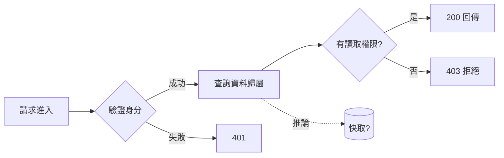

# 輸出模板與證據標記

需要穩定格式時使用。依任務刪減段落，不必每段都寫；以使用者語言輸出（下方標籤可翻譯）。

## 證據標記

每個重要結論後加一個標記，讀者一眼可知可信度：

| 標記 | 意義 | 例子 |
|---|---|---|
| `[已確認]` | 原始碼／文件中看得到，附位置 | `[已確認 auth/middleware.ts:42]` |
| `[實測]` | 實際執行、測試或 log 證實 | `[實測 npm test auth.spec]` |
| `[推論]` | 由已知證據推得，尚未證實 | `[推論：依函式名稱與呼叫順序]` |
| `[未知]` | 讀不到或無法判斷，說明缺什麼 | `[未知：未提供 gateway 設定]` |

英文：`[confirmed]` `[tested]` `[inferred]` `[unknown]`。圖表節點同樣標記；推論用虛線。

## 回覆骨架

```markdown
## 30 秒
一句話：〈它做什麼、為誰解決什麼〉
比喻：〈生活類比〉——但〈比喻在哪裡不成立〉。

## 3 分鐘：資料怎麼走
〈圖解，見下方 Mermaid〉
- 成功：〈路徑與結果〉[標記]
- 失敗：〈路徑、錯誤處理、使用者看到什麼〉[標記]
- 常見誤解：〈一句話〉

## 深入
| 先看這裡 | 為什麼 |
|---|---|
| `路徑:行號` | 〈這裡決定了什麼〉 |

邊界與風險：〈權限／資料遺失／競態／資安／效能，只寫相關的〉
驗證方法：〈可重現的指令或測試情境〉

## 未確認清單
- 〈假設〉：要確認請〈做什麼〉
```

## Mermaid 圖解模板



規則：成功與失敗路徑都要畫；推論用 `-.->` 虛線；節點不超過約 12 個，超過就拆圖；圖下方附一段等價純文字，供無法顯示圖的讀者使用。

## 讀者自測（交付前自己先答一次）

1. 資料從哪裡來？
2. 成功時去哪裡？
3. 失敗時怎麼辦？
4. 哪些結論還沒確認？
5. 要修改時先看哪裡？

任何一題答不出來，或答案沒有證據標記，就補上或明說未知。
